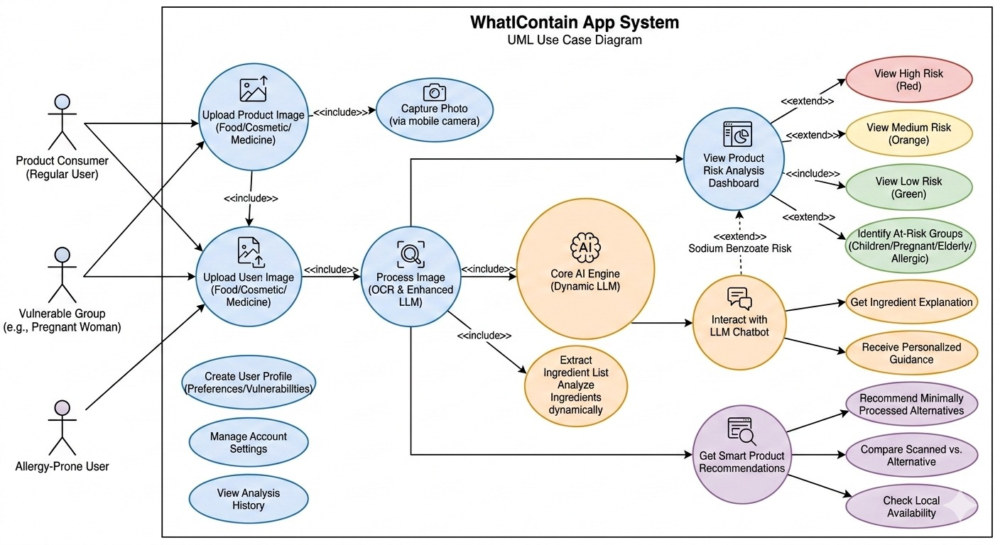
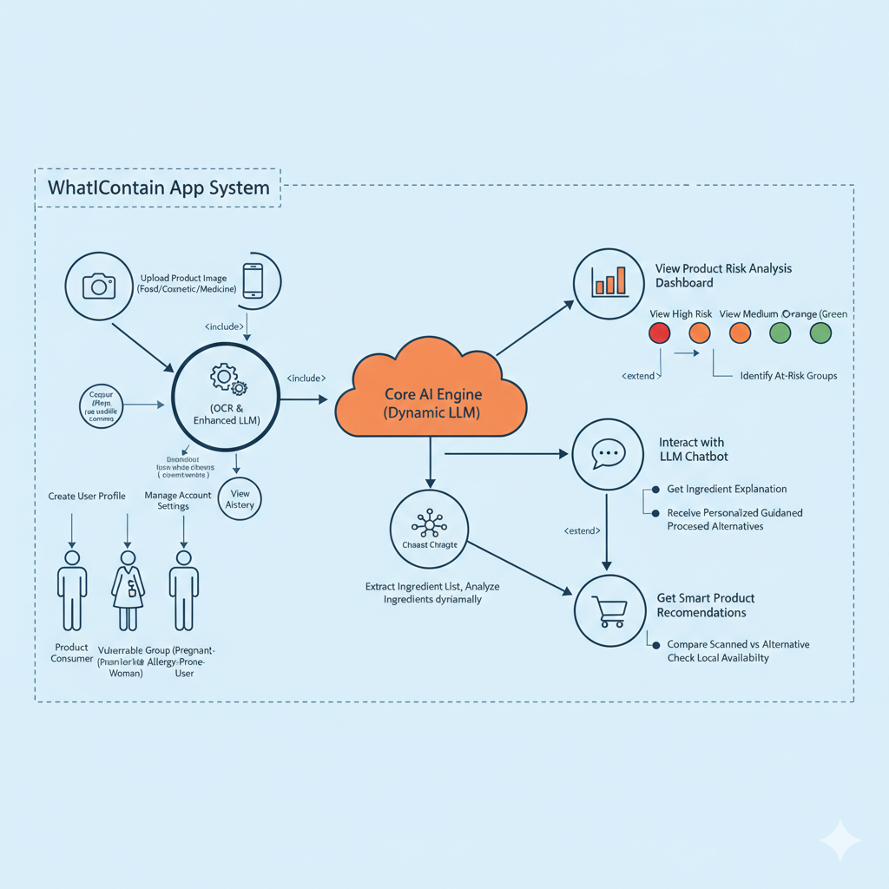

<p align="center">
  
</p>

# [WhatIContain] 🎯

## Basic Details

### Team Name: [SheCodes]

### Team Members
- Member 1: [Archana K R] - [Government Engineering College, Palakkad]
- Member 2: [Najiya K K] - [Government Engineering College, Palakkad]

### Hosted Project Link
[https://github.com/archanaram372-sh/WhatIContain/]

### Project Description
[What I Contain is an AI-powered safety scanner that allows users to instantly analyze product labels across cosmetics, food, and healthcare. By using the Gemini 3 Flash model, it extracts ingredient lists from photos and provides a simplified safety report with numerical health scores.]

### The Problem statement
[Consumers are often overwhelmed by complex chemical names and "marketing speak" on product labels, making it difficult to identify hidden toxins, allergens, or harmful additives. Traditional manual research is time-consuming and requires specialized knowledge that the average shopper does not possess.]

### The Solution
[We provide a real-time mobile and web interface that translates "chemical jargon" into actionable data. By categorizing risks into High, Moderate, and Low and offering personalized warnings for specific demographics (like children or pregnant women), the app empowers users to make safer purchasing decisions in seconds.]

---

## Technical Details

### Technologies/Components Used

**For Software:**
- Languages used: [Python (Backend Logic), JavaScript (Frontend Interface), HTML5/CSS3 (UI Structure & Styling).]
- Frameworks used: [React.js (Frontend Framework), Flask (Python Web Framework), Vite (Frontend Build Tool).]
- Libraries used: [Backend: google-genai (Gemini API integration), Flask-CORS (Cross-Origin Resource Sharing), Pillow (Image processing), python-dotenv (Environment variable management).
Frontend: react-icons (UI iconography), Lucide-React (Optional icons), Fetch API (HTTP requests).]
- Tools used: [VS Code (Development Environment), Git/GitHub (Version Control), Gemini .5 Flash (AI Inference Engine), Postman (API Testing)]

**For Hardware:**
- Main components: [High-Resolution Camera: (Smartphone or Webcam) used for capturing clear images of ingredient labels. Processor: Minimum Quad-core CPU (for local development) or Cloud-based server (for hosting). Memory: 8GB RAM recommended for smooth development and local AI testing.]

- Specifications: [Camera: 720p minimum (1080p preferred) to ensure text legibility for OCR (Optical Character Recognition). Network: Active Internet Connection (required for Gemini API calls).]

- Tools required: [Standard Development Laptop/PC. Mobile Device (for testing real-world scanning and camera responsiveness).]

---

## Features

List the key features of your project:
- Feature 1_Expert AI Personas: [Uses specialized logic (e.g., Dermatologist for skincare, Nutritionist for food) to provide category-specific safety insights rather than generic text extraction.]
- Feature 2_Precision Risk Scoring: [Translates complex labels into a strict 0–100 Safety Score with color-coded risk levels (Low, Moderate, High) for instant user interpretation.]
- Feature 3_Vulnerable Group Alerts & Smart Alternatives: [Automatically flags ingredients unsafe for specific demographics, such as pregnant women, children, or those with common allergies.Also, Instantly suggests "clean" product alternatives for high-risk items, explaining exactly why the recommended product is a healthier choice.]
- Feature 4_Context-Aware Chatbot: [Allows users to ask follow-up questions about the scanned results in real-time, providing deeper education on specific chemical compounds.]

---

## Implementation

### For Software:

#### Installation
```bash
[Installation commands - e.g., npm install, pip install -r requirements.txt]
```
cd WhatIContain, Backend setup: cd backend
pip install flask flask-cors pillow python-dotenv google-genai, Frontend Setup: cd ../frontend
npm install
npm install react-icons

#### Run
```bash
[Run commands - e.g., npm start, python app.py]
```
Backend : python app.py
Frontend : npm run dev

### For Hardware:

#### Components Required
[List all components needed with specifications]
Computing Host: Laptop or PC (Core i5+, 8GB RAM) to run the Flask server and React UI.

Imaging Sensor: 1080p Web Camera or Integrated Smartphone Camera (for label legibility).

Internet Gateway: High-speed Wi-Fi or Ethernet (required for real-time Gemini API calls).

Mobile Test Device: Android or iOS device for testing the live camera interface.

#### Circuit Setup
[Explain how to set up the circuit]
Since this is a software-heavy AI project, the "circuit" involves the data flow between components:

Input Device: Connect the USB Web Camera to the PC or use the built-in mobile camera via the browser.

Server Link: Ensure the Frontend (React) is pointed to the Backend (Flask) local IP address (127.0.0.1:5000).

API Bridge: Ensure your .env file contains a valid GEMINI_KEY to allow the software to communicate with Google's AI servers.
---

## Project Documentation

### For Software:

#### Screenshots (Add at least 3)


Category Selection: 
Users choose a product type (Cosmetics, Food, etc.), which activates a specialized AI persona for context-aware analysis.


*Add caption explaining what this shows*
Image Capture:
The interface supports both direct image uploads and real-time laptop camera capture to digitize product labels.


*Add caption explaining what this shows*
Safety Scoring: The system generates a numerical Safety Score and color-coded Risk Level (e.g., "Moderate Risk" in yellow) based on ingredient toxicity.
Health Alerts: AI flags "Avoid if" conditions for specific demographics like children, pregnant women, or those with allergies.

#### Diagrams

**System Architecture:**



*Explain your system architecture - components, data flow, tech stack interaction*
1. User Interaction Layer
The system serves three primary user personas: Regular Consumers, Vulnerable Groups (e.g., pregnant women), and Allergy-Prone Users. They interact with the platform by:
Data Input: Uploading or capturing product images (Food, Cosmetics, or Medicine) via mobile/laptop camera.
Profile Management: Creating personalized profiles that store specific health vulnerabilities or preferences to tailor the analysis.
History Tracking: Accessing a "Scan History" to review previous product evaluations.

2. Processing & AI Core
The backend architecture centers on a Dynamic LLM Core AI Engine:
OCR & Extraction: Processes raw images to extract ingredient lists dynamically.
Dynamic Analysis: Evaluates extracted data against health safety standards in real-time.

3. Analysis & Output Modules
The system generates three distinct types of output:
Risk Dashboard: Visualizes safety scores with color-coded risk tiers—Red (High), Orange (Medium), and Green (Low). It specifically identifies risks for at-risk groups like children or the elderly.
Conversational Assistant: An LLM-powered chatbot that allows users to ask for specific ingredient explanations or receive personalized health guidance.
Smart Recommendations: Suggests minimally processed alternatives, compares them against the scanned product, and checks for local availability.

**Application Workflow:**


*Add caption explaining your workflow*

---

### For Hardware:

#### Schematic & Circuit



*Add caption explaining connections*
Input Stage (Capture): The user interacts with the Camera Module (Hardware) to capture light data, which is converted into digital signals. This data is sent through the Client Interface (Frontend) to the processing unit.
Processing Stage (AI Core): The digital image travels to the Core AI Engine (Dynamic LLM). This acts as the "Central Processor" of the system, performing OCR (Optical Character Recognition) to extract text and Dynamic Analysis to identify chemical compounds.
Logic & Decision Stage: The engine evaluates the data against pre-defined health safety thresholds. It applies specialized "Expert Personas" to determine if a compound is a risk based on the product category.
Output Stage (Visualization): The results are transmitted back to the Risk Analysis Dashboard. This triggers visual output components:
Logic Gates: Determine which color-coded risk level (Red, Orange, or Green) to activate.
Communication Module: Sends personalized guidance to the LLM Chatbot for interactive user queries.
Recommendation Engine: Fetches data for safer alternatives based on the analysis result.


*Add caption explaining the schematic*

#### Build Photos


*List out all components shown*


*Explain the build steps*


*Explain the final build*

---

## Additional Documentation

### For Web Projects with Backend:

#### API Documentation

**Base URL:** http://127.0.0.1:5000 (Local Development)

##### Endpoints

**GET /api/endpoint**
- **Description:** [What it does]
- **Parameters:**
  - `param1` (string): [Description]
  - `param2` (integer): [Description]
POST /analyze
Description: Accepts a product label image and category to return a detailed AI safety report.
Parameters (Multipart/Form-Data):
   file (image): The uploaded image of the product label.
   category (string): The product type (e.g., "cosmetics", "food").
- **Response:**
{
  "safety_score": 72,
  "overall_product_risk": "Moderate",
  "high_risk_ingredients": ["Salicylic Acid"],
  "low_risk_ingredients": ["Aqua", "Glycerin"],
  "not_recommended_for": ["Pregnant Women"],
  "demographic_reasons": "Contains BHA which can cause irritation...",
  "safer_alternatives": [
    {
      "product_name": "Alternative Name",
      "why_better": "Lower concentration of irritants."
    }
  ]
}
```json
{
  "status": "success",
  "data": {}
}
```

**POST /api/endpoint**
- **Description:** [What it does]
- **Request Body:**
POST /chat
Description: Handles follow-up questions about a previously scanned product using stored context.
Request Body :
{
  "query": "Is this safe for children?",
  "context": "{Full JSON object from /analyze}",
  "category": "cosmetics"
}
```json
{
  "field1": "value1",
  "field2": "value2"
}
```
- **Response:**
```json
{
  "status": "success",
  "message": "Operation completed"
}
Response : 
{
  "reply": "Based on the ingredients, this product is generally safe, but avoid use on children under 3 due to..."
}
```

[Add more endpoints as needed...]

---

### For Mobile Apps:

#### App Flow Diagram


*Explain the user flow through your application*

#### Installation Guide

**For Android (APK):**
1. Download the APK from [Release Link]
2. Enable "Install from Unknown Sources" in your device settings:
   - Go to Settings > Security
   - Enable "Unknown Sources"
3. Open the downloaded APK file
4. Follow the installation prompts
5. Open the app and enjoy!

**For iOS (IPA) - TestFlight:**
1. Download TestFlight from the App Store
2. Open this TestFlight link: [Your TestFlight Link]
3. Click "Install" or "Accept"
4. Wait for the app to install
5. Open the app from your home screen

**Building from Source:**
```bash
# For Android
flutter build apk
# or
./gradlew assembleDebug

# For iOS
flutter build ios
# or
xcodebuild -workspace App.xcworkspace -scheme App -configuration Debug
```

---

### For Hardware Projects:

#### Bill of Materials (BOM)

| Component | Quantity | Specifications | Price | Link/Source |
|-----------|----------|----------------|-------|-------------|
| Arduino Uno | 1 | ATmega328P, 16MHz | ₹450 | [Link] |
| LED | 5 | Red, 5mm, 20mA | ₹5 each | [Link] |
| Resistor | 5 | 220Ω, 1/4W | ₹1 each | [Link] |
| Breadboard | 1 | 830 points | ₹100 | [Link] |
| Jumper Wires | 20 | Male-to-Male | ₹50 | [Link] |
| [Add more...] | | | | |

**Total Estimated Cost:** ₹[Amount]

#### Assembly Instructions

**Step 1: Prepare Components**
1. Gather all components listed in the BOM
2. Check component specifications
3. Prepare your workspace

*Caption: All components laid out*

**Step 2: Build the Power Supply**
1. Connect the power rails on the breadboard
2. Connect Arduino 5V to breadboard positive rail
3. Connect Arduino GND to breadboard negative rail

*Caption: Power connections completed*

**Step 3: Add Components**
1. Place LEDs on breadboard
2. Connect resistors in series with LEDs
3. Connect LED cathodes to GND
4. Connect LED anodes to Arduino digital pins (2-6)

*Caption: LED circuit assembled*

**Step 4: [Continue for all steps...]**

**Final Assembly:**

*Caption: Completed project ready for testing*

---

### For Scripts/CLI Tools:

#### Command Reference

**Basic Usage:**
```bash
python script.py [options] [arguments]
```
Run the backend server from the project root directory:
python app.py

**Available Commands:**
- `command1 [args]` - Description of what command1 does
    python app.py: Launches the Flask development server on http://127.0.0.1:5000
- `command2 [args]` - Description of what command2 does
    pip install -r requirements.txt: Installs all necessary Python dependencies (Flask, GenAI, Pillow).
- `command3 [args]` - Description of what command3 does
    python -m flask run: An alternative way to start the server if the Flask environment variables are configured.

**Options:**
- `-h, --help` - Show help message and exit
- `-v, --verbose` - Enable verbose output
- `-o, --output FILE` - Specify output file path
- `-c, --config FILE` - Specify configuration file
- `--version` - Show version information

--host=0.0.0.0: Allows the server to be accessible from other devices on your local network (e.g., testing on a mobile phone).
--port=5000: Specifies the network port for the backend service.
debug=True: Enables hot-reloading, which automatically restarts the server when you save changes to your code.

**Examples:**

```bash
# Example 1: Basic Backend Start
Launches the Flask server to handle image analysis and AI chat
python app.py

# Example 2: Frontend Development Mode
Runs the React interface with hot-reloading enabled
npm run dev

# Example 3: Installing Dependencies
 Ensures the environment has all required libraries like google-genai and Flask
pip install -r requirements.txt

# Example 4: Testing API Connectivity
 Verifies the backend is reachable on the local network (port 5000)
curl http://127.0.0.1:5000/
```

#### Demo Output


**Example 1: Basic Processing**
Example 1: Cosmetic Ingredient Analysis
**Input:**
```
Image: A photo of a skincare label containing "Aqua, Glycerin, Salicylic Acid (2%), Triethanolamine."
Selected Category: "Cosmetics"
```

**Command:**
```bash
# Backend processes the multipart form-data from the React frontend
POST /analyze { file: <image_data>, category: "cosmetics" }
```

**Output:**
```
{
  "status": "success",
  "product_analysis": {
    "safety_score": 72,
    "risk_level": "Moderate Risk",
    "flagged_ingredients": ["Salicylic Acid (2%)", "Triethanolamine"],
    "safe_ingredients": ["Aqua", "Glycerin"],
    "demographic_alert": "Avoid if: Pregnant, breastfeeding, or sensitive skin types.",
    "reason": "Contains BHA which can cause irritation in high concentrations."
  }
}
```

**Example 2: Advanced Usage**
Example 2: AI Health Assistant Interaction

**Input:**
```Query: "Is this product safe for my 2-year-old child?"
Context: Data from the previous "Cosmetics" scan.
```

**Command:**
```bash
# Sends a follow-up query to the ChatBot endpoint
POST /chat { query: "Is this safe for my 2-year-old?", context: {...} }
```

**Output:**
```
{
  "reply": "No, it is not recommended for children under 3. The Salicylic Acid in this product is too harsh for an infant's developing skin barrier and may cause severe dryness or irritation."
}
```

---

## Project Demo

### Video
[Add your demo video link here - YouTube, Google Drive, etc.]

*Explain what the video demonstrates - key features, user flow, technical highlights*

### Additional Demos
[Add any extra demo materials/links - Live site, APK download, online demo, etc.]

---

## AI Tools Used (Optional - For Transparency Bonus)

If you used AI tools during development, document them here for transparency:

**Tool Used:** [e.g., GitHub Copilot, v0.dev, Cursor, ChatGPT, Claude]
Tool Used: Gemini 3 Flash (via Google AI Studio/Web)

**Purpose:** [What you used it for]
  Assisted in bridging the Flask (Python) backend with the React (Vite) frontend using multipart/form-data for image uploads.
  Crafted the specialized "Threshold Rules" that ensure the AI provides a numerical safety score consistent with its risk categorization.
  Resolved environment-specific errors, such as the ImportError: cannot import name 'genai' by identifying library version conflicts.

**Key Prompts Used:**
- "Write a React component that can capture an image from a laptop webcam and send it to a Python backend."
- "Format the AI response into a strict JSON schema including safety_score, risk_level, and demographic_reasons."
- "Debug the Vite import error for a ChatBot component in a React project structure"

**Percentage of AI-generated code:** [Approximately X%]
  50%

**Human Contributions:**
- Architecture design and planning
- Custom logic implementation
- Integration and testing
- UI/UX design decisions

*Note: Proper documentation of AI usage demonstrates transparency and earns bonus points in evaluation!*

---

## Team Contributions

- [Archana K R]: [Specific contributions - e.g., Frontend development, API integration, Backend development, Testing etc.]
- [Najiya K K]: [Specific contributions - e.g., UI/UX design, System architecture design, Documentation etc.]

---

## License

This project is licensed under the [ MIT License LICCopyright (c) 2026 archanaram372-sh
] License - see the [LICENSE](LICENSE) file for details.

**Common License Options:**
- MIT License (Permissive, widely used)
- Apache 2.0 (Permissive with patent grant)
- GPL v3 (Copyleft, requires derivative works to be open source)

---

Made with ❤️ at TinkerHub
